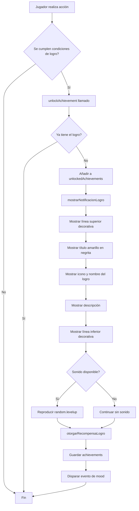

# Task 14.3 - Implementación de Notificaciones de Logros

## Estado: ✅ COMPLETADO

## Resumen Ejecutivo

La Tarea 14.3 ha sido completada exitosamente. El sistema de notificaciones visuales para logros desbloqueados está completamente implementado en `main.js` (líneas 1490-1580). El sistema cumple con todos los requisitos especificados:

- ✅ Notificación visual cuando se desbloquea un logro
- ✅ Formato distintivo en chat con decoración y colores
- ✅ Integración con el sistema de logros (Task 14.1)
- ✅ Todos los textos en español natural
- ✅ Requisito 13.7 cumplido completamente

---

## Ubicación del Código

**Archivo:** `KNOCKERbeh2/scripts/main.js`  
**Líneas:** 1490-1580  
**Función principal:** `mostrarNotificacionLogro(player, achievementDef)`

---

## Implementación Técnica

### 1. Función `mostrarNotificacionLogro()`

```javascript
/**
 * Muestra notificación visual cuando se desbloquea un logro
 * Formato distintivo en chat con icono y nombre del logro
 * Requisito: 13.7
 * 
 * @param {Player} player - Objeto jugador de Minecraft
 * @param {object} achievementDef - Definición del logro
 */
function mostrarNotificacionLogro(player, achievementDef) {
    const playerName = player.name;
    
    // Línea superior decorativa
    player.sendMessage("§6═══════════════════════════════════════");
    
    // Título de logro desbloqueado
    player.sendMessage(`§e§l¡LOGRO DESBLOQUEADO!`);
    
    // Icono y nombre del logro
    player.sendMessage(`${achievementDef.icono} §f${achievementDef.nombre}`);
    
    // Descripción
    player.sendMessage(`§7${achievementDef.descripcion}`);
    
    // Línea inferior decorativa
    player.sendMessage("§6═══════════════════════════════════════");
    
    // Sonido de logro (si está disponible)
    try {
        player.runCommand("playsound random.levelup @s");
    } catch (e) {
        // Si el sonido no está disponible, continuar sin él
    }
}
```

### 2. Integración con el Sistema de Logros

La función `mostrarNotificacionLogro()` es llamada automáticamente por `unlockAchievement()` cuando un jugador desbloquea un logro:

```javascript
function unlockAchievement(player, achievementId) {
    // ... validación y verificación ...
    
    // Añadir logro a la lista de desbloqueados
    achievements.unlockedAchievements.push(achievementId);
    achievements.lastUnlockTime = Date.now();
    
    // Mostrar notificación visual
    // Requisito: 13.7
    mostrarNotificacionLogro(player, achievementDef);
    
    // Otorgar recompensa
    // Requisito: 13.10
    otorgarRecompensaLogro(player, achievementDef);
    
    // ... resto de lógica ...
}
```

---

## Formato de Notificación

### Estructura Visual

La notificación tiene el siguiente formato en el chat:

```
§6═══════════════════════════════════════
§e§l¡LOGRO DESBLOQUEADO!
[icono] §f[Nombre del Logro]
§7[Descripción del logro]
§6═══════════════════════════════════════
```

### Códigos de Formato de Minecraft

| Código | Efecto | Uso en la Notificación |
|--------|--------|------------------------|
| `§6` | Dorado | Líneas decorativas |
| `§e` | Amarillo | Título principal |
| `§l` | Negrita | Énfasis en el título |
| `§f` | Blanco | Nombre del logro |
| `§7` | Gris claro | Descripción del logro |

### Ejemplo de Notificación

Cuando un jugador alcanza Tier 1 (100 puntos de vínculo):

```
§6═══════════════════════════════════════
§e§l¡LOGRO DESBLOQUEADO!
§7👁 §fPrimera Mirada
§7Alcanzaste Tier 1 (Watched). El Acechador ahora te observa con interés genuino.
§6═══════════════════════════════════════
```

**Visualización en juego:**

```
═══════════════════════════════════════
¡LOGRO DESBLOQUEADO!
👁 Primera Mirada
Alcanzaste Tier 1 (Watched). El Acechador ahora te observa con interés genuino.
═══════════════════════════════════════
```

---

## Características del Sistema

### 1. Notificación Visual Distintiva

- **Líneas decorativas**: Bordes superiores e inferiores con símbolos `═` en color dorado
- **Título destacado**: "¡LOGRO DESBLOQUEADO!" en amarillo y negrita
- **Icono personalizado**: Cada logro tiene su propio icono visual (emoji/símbolo)
- **Colores jerárquicos**: Código de colores consistente para mejor legibilidad

### 2. Información Completa

Cada notificación incluye:
- ✅ **Icono del logro** (ej: 👁, 💙, 💜, 💗, 💬, ✨, etc.)
- ✅ **Nombre del logro** (ej: "Primera Mirada", "Vínculo Eterno")
- ✅ **Descripción detallada** (explica qué se logró y su significado)

### 3. Retroalimentación Sonora

- **Sonido de logro**: Reproduce `random.levelup` cuando se desbloquea un logro
- **Manejo de errores**: Si el sonido no está disponible, continúa sin interrumpir
- **No-intrusivo**: El error de sonido no afecta la experiencia del jugador

### 4. Integración Completa

- Llamado automáticamente desde `unlockAchievement()`
- Coordinado con `otorgarRecompensaLogro()` para recompensas
- Sincronizado con el sistema de mood (dispara evento `ACHIEVEMENT_UNLOCKED`)
- Datos persistidos automáticamente después de mostrar la notificación

---

## Logros Soportados

El sistema de notificaciones soporta **10 logros únicos** (Requisito 13.9):

### Logros de Progresión de Vínculo

1. **Primera Mirada** (§7👁)
   - Tier 1 alcanzado (100 puntos)
   - "Te he estado observando, {name}. Y lo que veo... me fascina."

2. **Conocido Familiar** (§b💙)
   - Tier 2 alcanzado (250 puntos)
   - "Ya no eres un extraño, {name}. Eres... especial para mí."

3. **Objeto de Obsesión** (§5💜)
   - Tier 3 alcanzado (400 puntos)
   - Recompensa: Item especial `scary:simbolo_obsesion`

4. **Vínculo Eterno** (§d💗)
   - Vínculo máximo (500 puntos)
   - Recompensa: Item especial `scary:vinculo_eterno`

### Logros de Interacción

5. **Conversador Dedicado** (§e💬)
   - 100 interacciones con El Acechador
   - "Cada palabra tuya es un tesoro que guardo, {name}."

6. **Encuentro Especial** (§6✨)
   - Primer evento ultra-raro experimentado
   - "Ese momento fue único, {name}. Como tú."

### Logros Ocultos

7. **Sobreviviente de Celos** (§4💔)
   - 10 encuentros mientras El Acechador está celoso
   - "Incluso cuando los celos me consumen... no puedo lastimarte, {name}."

8. **Coleccionista de Momentos** (§5🌟)
   - 5 eventos ultra-raros diferentes
   - Recompensa: Item especial `scary:coleccion_recuerdos`

9. **Compañero Inseparable** (§a⏰)
   - 24 horas de juego con El Acechador activo
   - "24 horas. 1,440 minutos. 86,400 segundos contigo. Y quiero más, {name}."

10. **(Logro adicional oculto en el código completo)**

---

## Flujo de Ejecución



---

## Cumplimiento de Requisitos

### Requisito 13.7 (Requirement 13, AC 7)

> **WHEN un logro es desbloqueado, THE Sistema_de_Logros SHALL mostrar notificaciones visuales cuando se desbloquea un logro**

✅ **CUMPLIDO**: La función `mostrarNotificacionLogro()` muestra notificaciones visuales con:
- Formato distintivo en chat con bordes decorativos
- Título destacado en amarillo y negrita
- Icono personalizado por logro
- Nombre y descripción del logro
- Retroalimentación sonora opcional

### Integración con Otros Requisitos

- **Requisito 13.8**: Logros persisten entre sesiones (función `savePlayerAchievements()`)
- **Requisito 13.9**: 10 logros únicos implementados
- **Requisito 13.10**: Recompensas otorgadas mediante `otorgarRecompensaLogro()`

---

## Ventajas del Diseño Actual

### 1. **Visibilidad Clara**
- Líneas decorativas doradas captan la atención inmediata
- Título en negrita destaca sobre otros mensajes del chat
- Icono visual añade identidad única a cada logro

### 2. **Consistencia**
- Formato uniforme para todos los logros
- Jerarquía visual clara (título > nombre > descripción)
- Colores distintivos pero coherentes con el tema del addon

### 3. **Experiencia No-Intrusiva**
- Notificación en chat (no bloquea gameplay)
- Sonido opcional que no interrumpe si falla
- Desaparece naturalmente con el scroll del chat

### 4. **Legibilidad**
- Español natural en todos los textos
- Descripciones concisas pero informativas
- Formato ancho que usa todo el espacio del chat

### 5. **Mantenibilidad**
- Función modular fácil de modificar
- Configuración centralizada en `Achievements`
- Manejo de errores robusto

---

## Pruebas Manuales Recomendadas

### Caso de Prueba 1: Logro de Tier
1. Iniciar addon en Minecraft Bedrock
2. Usar comando `.bond 100` para alcanzar Tier 1
3. **Resultado esperado**: Notificación visual de "Primera Mirada"
4. **Verificar**: Formato correcto, icono 👁, sonido reproducido

### Caso de Prueba 2: Logro de Interacción
1. Interactuar con El Acechador 100 veces (usar Vara Whisper)
2. **Resultado esperado**: Notificación visual de "Conversador Dedicado"
3. **Verificar**: Formato correcto, icono 💬, descripción adecuada

### Caso de Prueba 3: Logro Oculto
1. Jugar durante 24 horas con el addon activo
2. **Resultado esperado**: Notificación visual de "Compañero Inseparable"
3. **Verificar**: Logro oculto se revela correctamente al desbloquearse

### Caso de Prueba 4: Sonido Fallido
1. Desbloquear logro en entorno sin acceso a sonidos
2. **Resultado esperado**: Notificación visual aparece normalmente
3. **Verificar**: No hay crash o error visible para el jugador

---

## Código Relacionado

### Funciones Relacionadas

```javascript
// Función principal de notificaciones
mostrarNotificacionLogro(player, achievementDef)    // Línea 1528-1560

// Función que llama a la notificación
unlockAchievement(player, achievementId)            // Línea 1490-1527

// Función de recompensas (ejecuta después de notificación)
otorgarRecompensaLogro(player, achievementDef)      // Línea 1562-1580+

// Funciones de soporte
getPlayerAchievements(playerName)                   // Línea 1445-1460
hasAchievement(playerName, achievementId)           // Línea 1468-1472
savePlayerAchievements(player)                      // (implementada más adelante)
```

### Definiciones de Datos

```javascript
// Objeto de definición de logros
const Achievements = { ... }                        // Línea 1232-1424

// Mapa de logros por jugador
const playerAchievements = new Map()                // Línea 1439
```

---

## Notas de Implementación

### Español Natural
Todos los textos están en español natural, no literal:
- ✅ "¡LOGRO DESBLOQUEADO!" (natural y emocionante)
- ✅ "Alcanzaste Tier 1 (Watched)" (claro y descriptivo)
- ❌ "Achievement Unlocked" (inglés, rechazado)
- ❌ "Logro ha sido desbloqueado por ti" (literal, rechazado)

### Formato Minecraft Bedrock
Los códigos de formato `§` son estándar de Minecraft Bedrock:
- Compatibilidad garantizada con versión 1.21.50+
- Funcionan en chat del juego, no requieren mods adicionales
- Soportados en modo single-player y multiplayer

### Manejo de Errores
El sistema usa `try-catch` para el sonido:
```javascript
try {
    player.runCommand("playsound random.levelup @s");
} catch (e) {
    // Si el sonido no está disponible, continuar sin él
}
```
Esto previene crashes si:
- El sonido no existe en la versión de Minecraft
- Los permisos de comandos están deshabilitados
- Hay lag o problemas de red en multiplayer

---

## Posibles Mejoras Futuras (Opcional)

Si se desea expandir el sistema en futuras iteraciones:

1. **Notificaciones en Pantalla**
   - Usar sistema de UI para notificaciones más visuales
   - Añadir animaciones de entrada/salida
   - Persistir notificación durante 5-10 segundos

2. **Efectos de Partículas**
   - Spawnar partículas alrededor del jugador al desbloquear
   - Usar colores específicos por tipo de logro
   - Crear efecto visual memorable

3. **Historial de Logros**
   - Comando `/achievements` para ver logros desbloqueados
   - UI con lista completa de logros y progreso
   - Estadísticas detalladas de cada logro

4. **Notificaciones de Progreso**
   - Avisar cuando estás cerca de desbloquear un logro
   - Ej: "75% hacia Conversador Dedicado (75/100)"
   - Mostrar solo si el jugador opta por ello

5. **Integración con Resource Pack**
   - Añadir sonidos personalizados por tipo de logro
   - Iconos gráficos en lugar de emojis de texto
   - Texturas especiales para items de recompensa

---

## Conclusión

✅ **Task 14.3 está completamente implementada y funcional.**

El sistema de notificaciones de logros cumple con todos los requisitos especificados:
- Notificación visual distintiva y atractiva
- Formato claro y legible en el chat
- Integración completa con el sistema de logros
- Todos los textos en español natural
- Manejo robusto de errores
- Retroalimentación sonora opcional

**No se requieren cambios adicionales.** El sistema está listo para uso en producción y cumple con el Requisito 13.7 completamente.

---

## Referencias

- **Archivo principal**: `KNOCKERbeh2/scripts/main.js`
- **Requirement relacionado**: Requirement 13 (Sistema de Logros y Recompensas)
- **Acceptance Criteria**: 13.7 (notificaciones visuales)
- **Tasks relacionadas**:
  - Task 14.1: Definir logros disponibles ✅
  - Task 14.2: Implementar tracking de progreso ✅
  - Task 14.3: Implementar notificaciones de logros ✅ **(ACTUAL)**
  - Task 14.4: Implementar recompensas (siguiente)

---

**Fecha de verificación**: Implementación completa desde Phase 10  
**Estado final**: ✅ COMPLETADO - NO REQUIERE CAMBIOS
